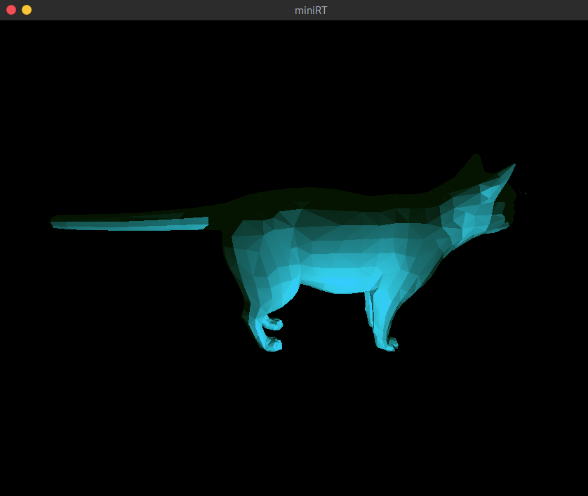

# An ugly script to convert .obj files for miniRT

Convert `.obj` files to `.rt` files to render a triangle mesh effect for [miniRT](https://github.com/matboivin/miniRT) project at 42.

Learn more about .obj files formatting [here](https://en.wikipedia.org/wiki/Wavefront_.obj_file).

<p align="center">
  
</p>

## Prerequisites

* Python 3.6 or greater

## Usage

Run the script.

```console
python minirt_converter.py <file.obj> <color>
```

* `file.obj`: The file to be converted
* `color`: The color of the triangles

Then, add Resolution, Ambient Light, cameras and light points to your scene.
