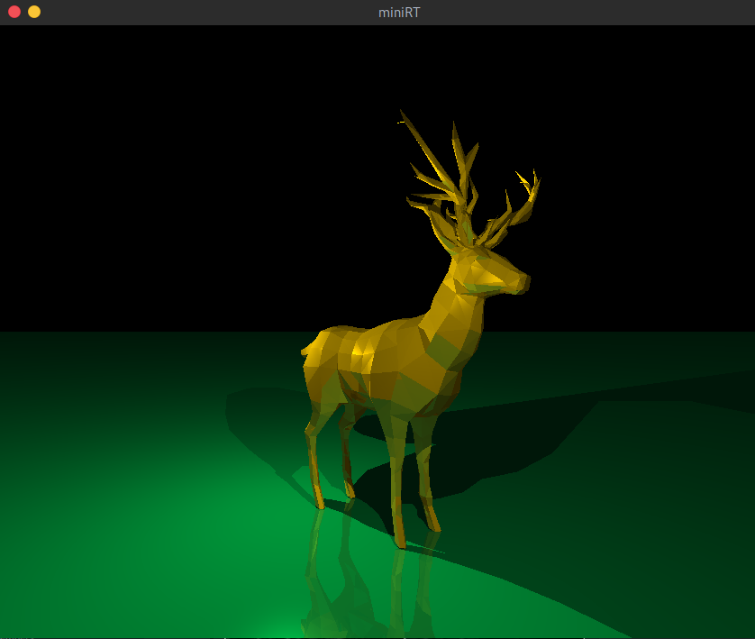
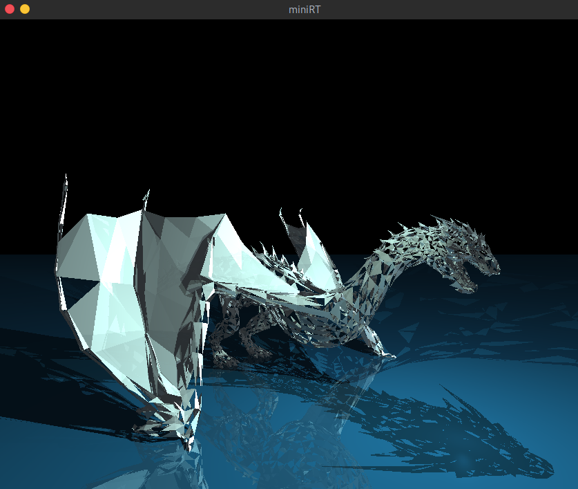
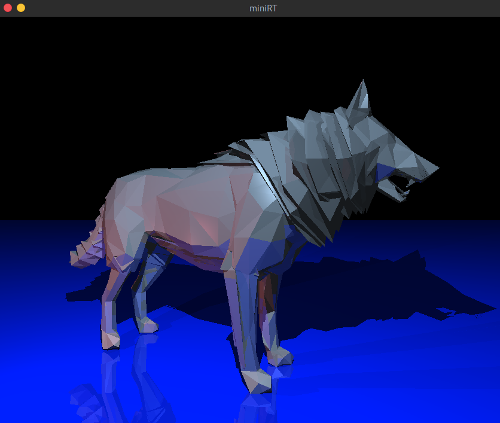

# Convert .obj files for 42's miniRT

[](https://github.com/psf/black) [](https://github.com/pre-commit/pre-commit) [](https://github.com/PyCQA/bandit)

Convert `.obj` files to `.rt` files to render a triangle mesh effect for [miniRT](https://github.com/matboivin/raytracer) project at 42.

<p align="center">
  
</p>

## Requirements

* Python 3.9 or greater
* [`poetry`](https://python-poetry.org/)
* Learn more about `.obj` files formatting [here](https://en.wikipedia.org/wiki/Wavefront_.obj_file).

## Installation

1. Clone the repository and change it to your working directory.

2. Install the project:

  ```console
  $ poetry install
  ```

## Usage

```console
minirt_converter [-h] filename color

Convert .obj files to .rt files to render a triangle mesh effect for miniRT project at 42.

positional arguments:
  filename    obj file to convert.
  color       the color in RGB format (e.g., 255,255,255).

optional arguments:
  -h, --help  show this help message and exit

example usage:
  minirt_converter file.obj 255,255,255
```

1. Activate the virtual environment:

  ```console
  $ source `poetry env info --path`/bin/activate
  ```

2. Run the project:

  ```console
  $ minirt_converter file.obj 255,255,255
  ```

3. Then, **add Resolution, Ambient Light, cameras and light points** to your [scene](https://github.com/matboivin/raytracer/blob/main/doc/scene_file.md).

### Examples

The `deer.rt`, `dragon.rt` and `wolf3d.rt` scenes can be found [here](https://github.com/matboivin/raytracer/tree/main/scenes).

<p align="center">
  
  
</p>

## Acknowledgements

Many thanks to [MrMoustach](https://github.com/MrMoustach) for contributing by adding a polygon support!

## License

<a rel="license" href="http://creativecommons.org/licenses/by-nc/4.0/"></a>

This work is licensed under a
[Creative Commons Attribution-NonCommercial 4.0 International License](http://creativecommons.org/licenses/by-nc/4.0/).
